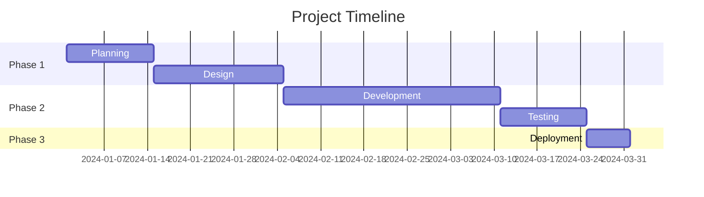

# Progress Reporting Templates

## Weekly Status Report

```markdown
# Weekly Status Report - [Project Name]

**Reporting Period**: [Start Date] to [End Date]
**Report Date**: YYYY-MM-DD
**Project Status**: `on_track` | `at_risk` | `behind`

## Executive Summary
[2-3 sentence overview of project status, key achievements, and major concerns]

## Progress This Week

### Completed
- [ ] Task 1: [Description]
- [ ] Task 2: [Description]
- [ ] Task 3: [Description]

### In Progress
- [ ] Task 4: [Description] - [% complete]
- [ ] Task 5: [Description] - [% complete]

### Planned for Next Week
- [ ] Task 6: [Description]
- [ ] Task 7: [Description]

## Key Metrics
- **Total Tasks**: [number]
- **Completed This Week**: [number]
- **Remaining Tasks**: [number]
- **Overall Progress**: [percentage]%
- **On Schedule**: Yes/No

## Blockers & Issues
| Issue | Impact | Action Plan | Owner | Target Resolution |
|-------|--------|-------------|-------|-------------------|
| [Issue 1] | [High/Medium/Low] | [Plan] | [Person] | [Date] |
| [Issue 2] | [High/Medium/Low] | [Plan] | [Person] | [Date] |

## Decisions & Changes
- [Decision 1]: [Description and rationale]
- [Decision 2]: [Description and rationale]

## Next Week's Focus
1. [Primary focus area]
2. [Secondary focus area]
3. [Risk mitigation activities]

## Team Notes
[Any team-related updates, recognition, or concerns]
```

## Daily Standup Template

```markdown
# Daily Standup - [Date]

## Yesterday
- [Person 1]: [What I did yesterday]
- [Person 2]: [What I did yesterday]

## Today
- [Person 1]: [What I'm doing today]
- [Person 2]: [What I'm doing today]

## Blockers
- [Person 1]: [Any blockers?]
- [Person 2]: [Any blockers?]

## Quick Wins
- [Small achievement 1]
- [Small achievement 2]
```

## Milestone Report

```markdown
# Milestone Report: [Milestone Name]

**Milestone**: [Milestone description]
**Target Date**: YYYY-MM-DD
**Actual Date**: YYYY-MM-DD
**Status**: `achieved` | `partially_achieved` | `not_achieved`

## Milestone Objectives
- [ ] Objective 1: [Description] - `met`/`not_met`
- [ ] Objective 2: [Description] - `met`/`not_met`
- [ ] Objective 3: [Description] - `met`/`not_met`

## Deliverables
| Deliverable | Status | Notes |
|-------------|--------|-------|
| [Deliverable 1] | `completed`/`in_progress`/`pending` | [Notes] |
| [Deliverable 2] | `completed`/`in_progress`/`pending` | [Notes] |

## Key Achievements
1. [Achievement 1]
2. [Achievement 2]
3. [Achievement 3]

## Lessons Learned
**What went well:**
- [Positive 1]
- [Positive 2]

**What could be improved:**
- [Improvement 1]
- [Improvement 2]

**Recommendations for next milestone:**
- [Recommendation 1]
- [Recommendation 2]

## Next Steps
1. [Immediate action after milestone]
2. [Preparation for next milestone]
```

## Project Dashboard Template

```markdown
# Project Dashboard - [Project Name]

**Last Updated**: YYYY-MM-DD HH:MM

## Health Indicators
- **Schedule**: `green`/`yellow`/`red`
- **Budget**: `green`/`yellow`/`red`
- **Scope**: `green`/`yellow`/`red`
- **Quality**: `green`/`yellow`/`red`
- **Team Morale**: `green`/`yellow`/`red`

## Progress Overview


## Task Status Breakdown
| Status | Count | Percentage |
|--------|-------|------------|
| Completed | [number] | [%] |
| In Progress | [number] | [%] |
| Pending | [number] | [%] |
| Blocked | [number] | [%] |
| **Total** | **[total]** | **100%** |

## Upcoming Deadlines
| Deadline | Task | Owner | Status |
|----------|------|-------|--------|
| YYYY-MM-DD | [Task] | [Person] | `on_track`/`at_risk` |
| YYYY-MM-DD | [Task] | [Person] | `on_track`/`at_risk` |

## Risk Register
| Risk | Probability | Impact | Mitigation | Owner |
|------|-------------|--------|------------|-------|
| [Risk 1] | High/Medium/Low | High/Medium/Low | [Plan] | [Person] |
| [Risk 2] | High/Medium/Low | High/Medium/Low | [Plan] | [Person] |
```

## Burn-down Chart Data Template

```markdown
# Burn-down Data - [Project Name]

**Total Story Points**: [number]
**Sprint Duration**: [number] days

| Day | Remaining Points | Completed Points | Ideal Trend |
|-----|------------------|------------------|-------------|
| 1 | [points] | 0 | [ideal] |
| 2 | [points] | [points] | [ideal] |
| 3 | [points] | [points] | [ideal] |
| ... | ... | ... | ... |
| [last day] | 0 | [total points] | 0 |

## Velocity Tracking
| Sprint | Planned Points | Completed Points | Velocity |
|--------|----------------|------------------|----------|
| Sprint 1 | [number] | [number] | [number] |
| Sprint 2 | [number] | [number] | [number] |
| Sprint 3 | [number] | [number] | [number] |

## Performance Metrics
- **Average Velocity**: [number]
- **Commitment Accuracy**: [percentage]%
- **Scope Change Rate**: [percentage]%
```

## Email Status Update Template

```markdown
Subject: Status Update - [Project Name] - [Date]

Hi Team,

Here's the status update for [Project Name] as of [Date]:

**Current Status**: [Brief status - 1 sentence]

**This Week's Accomplishments**:
• [Accomplishment 1]
• [Accomplishment 2]
• [Accomplishment 3]

**Next Week's Focus**:
• [Focus area 1]
• [Focus area 2]

**Key Metrics**:
• Progress: [percentage]% complete
• Tasks: [completed]/[total] tasks done
• Schedule: [days] ahead/behind schedule

**Blockers** (if any):
• [Blocker 1] - [Action being taken]
• [Blocker 2] - [Action being taken]

**Decisions Needed** (if any):
• [Decision 1] - [Context and options]
• [Decision 2] - [Context and options]

Let me know if you have any questions.

Best regards,
[Your Name]
```