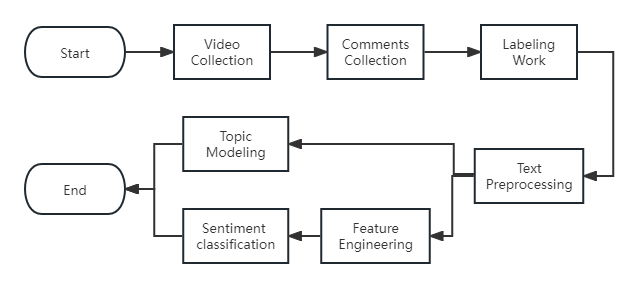
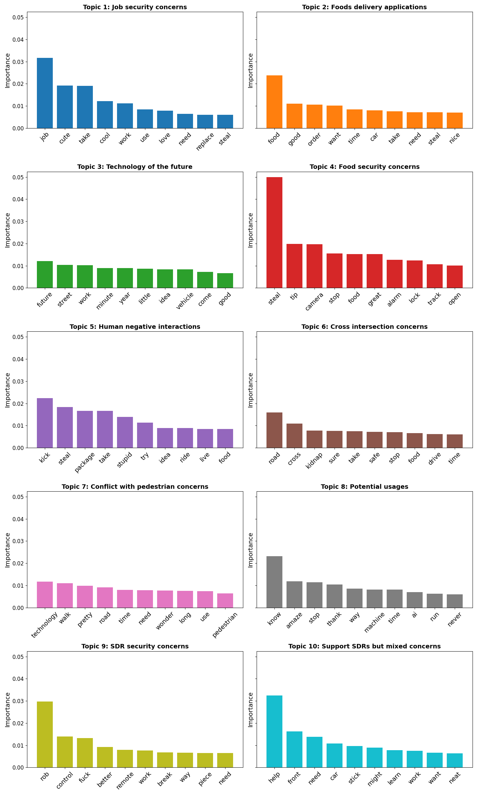

# YouTube-SC: YouTube Sentiment and Clustering Analysis


## Overview
This repository provides the official implementation of a data-driven framework for analyzing public perceptions of sidewalk delivery robots (SDRs) using YouTube comments.
The code supports large-scale sentiment classification, clustering analysis, topic modeling, and text statistics to uncover public concerns, interactions, and safety perceptions related to SDR deployment.

This repository accompanies our paper published in *Transportation Research Record* (2025).

---

## Related Paper
**Yuchen Du, Tho V. Le (2025)**
*Understanding Social Perceptions, Interactions, and Safety Aspects of Sidewalk Delivery Robots Using Sentiment Analysis*
Transportation Research Record
https://journals.sagepub.com/doi/abs/10.1177/03611981251394686

---

## Research Framework



This study follows a three-stage pipeline:
1. YouTube comment collection and preprocessing
2. Sentiment classification (ML-based and Deep Learning-based)
3. Topic modeling and interpretation

---
## Sentiment Classification

We implement both traditional machine learning models (e.g., Naive Bayes, SVM) and deep learning models (BERT + LSTM + GRU) for binary and ternary sentiment classification tasks. Feature engineering techniques include TF-IDF, N-grams, negation handling, and punctuation-aware preprocessing.

Model performance is evaluated using accuracy, precision, recall, and F1 score.

| Model               | Label      | Accuracy | Precision | Recall | F1   |
|---------------------|------------|----------|-----------|--------|------|
| MNB + (1,2) gram    | 0,1        | 0.84     | 0.84      | 0.84   | 0.83 |
| SVM + 1 gram        | 0,2        | 0.76     | 0.75      | 0.76   | 0.76 |
| SVM + 1 gram        | 1,2        | 0.79     | 0.79      | 0.79   | 0.78 |
| SVM + (1,4) gram    | 0, other   | 0.77     | 0.77      | 0.77   | 0.76 |
| SVM + (1,2) gram    | 1, other   | 0.86     | 0.86      | 0.86   | 0.84 |
| SVM + 1 gram        | 2, other   | 0.74     | 0.74      | 0.74   | 0.70 |
| MNB + (1,3) gram    | 0,1,2      | 0.68     | 0.70      | 0.68   | 0.68 |
| SVM + (1,2) gram    | 0,1,2      | 0.69     | 0.70      | 0.69   | 0.68 |
| DT + (1,2) gram     | 0,1,2      | 0.60     | 0.60      | 0.60   | 0.60 |
| BERT + LSTM + GRU   | 0,1,2      | 0.78     | 0.78      | 0.77   | 0.78 |

**Note:**  
BERT = Bidirectional Encoder Representations from Transformers;  
LSTM = Long Short-Term Memory;  
GRU = Gated Recurrent Unit;  
MNB = Multinomial Naive Bayes;  
SVM = Support Vector Machine;  
DT = Decision Tree.

---
## Topic Modeling and Key Findings

Latent Dirichlet Allocation (LDA) is applied to extract latent topics from user comments. The results highlight recurring public concerns, including:
- Job security and automation anxiety;
- Pedestrian safety and sidewalk conflicts;
- Food safety and robot security;
- Mixed attitudes toward future urban robotic technologies.

These insights inform policy discussions and urban deployment strategies for SDRs.


---

## Key Features

- **Multi-Method Sentiment Analysis**: Both traditional ML models (SVM, Naive Bayes, Random Forest) and deep learning (BERT) approaches
- **Comprehensive Clustering**: K-means and other clustering algorithms to group similar comments
- **Topic Modeling**: LDA-based topic extraction to identify discussion themes
- **Text Statistics**: Word frequency analysis, yearly trends, and text metrics
- **Modular Architecture**: Independent modules for each analysis type


---

## Repository Structure
```
Youtube-SC/
├── sentiment_classification_ML/      # Machine learning sentiment classification
├── sentiment_classification_Bert/    # BERT-based sentiment classification
├── sdr_clustering_analysis/          # Comment clustering analysis
├── topic_modeling/                   # Topic modeling analysis
├── yearly_word_frequency/            # Yearly word frequency analysis
├── data/                             # Shared data directory
├── docs/                             # Project documentation
├── .claude/                          # Claude Code configuration
├── requirements.txt                  # Project dependencies
├── setup-environment.sh              # Linux/Mac environment setup
└── setup-environment.bat             # Windows environment setup
```

---

## Documentation
### Core Documentation
- [Environment Setup](docs/setup.md) - Complete installation and configuration guide
- [Data Description](docs/data.md) - Dataset details and processing pipeline
- [Analysis Pipeline](docs/pipeline.md) - End-to-end analysis workflow
- [Sentiment Models](docs/sentiment_models.md) - ML and deep learning model architectures
- [Topic Modeling](docs/topic_modeling.md) - LDA implementation and interpretation
- [Experiment Reproduction](docs/reproduction.md) - Reproduce paper results

### Additional Guides
- [Project Structure](docs/project-structure.md) - Detailed repository organization
- [Usage Examples](docs/usage.md) - How to run each module
- [Troubleshooting](docs/troubleshooting.md) - Common issues and solutions
- [Management Tools](docs/management-tools.md) - Custom Claude Code skills
- [Development Recommendations](docs/development.md) - Best practices for development

---

## Quick Start
For detailed installation and usage instructions, see the [Environment Setup](docs/setup.md) guide.

1. **Clone the repository**:
   ```bash
   git clone https://github.com/yourusername/Youtube-SC.git
   cd Youtube-SC
   ```

2. **Set up environment**:
   ```bash
   # Windows
   setup-environment.bat

   # Linux/Mac
   ./setup-environment.sh
   ```

3. **Activate virtual environment** and run analyses as described in the [Usage Examples](docs/usage.md).

---

## Citation
If you use this code in your research, please cite our paper:

```bibtex
@article{du2025sdr,
  title   = {Understanding Social Perceptions, Interactions, and Safety Aspects of Sidewalk Delivery Robots Using Sentiment Analysis},
  author  = {Du, Yuchen and Le, Tho V.},
  journal = {Transportation Research Record},
  year    = {2025},
  doi     = {10.1177/03611981251394686}
}
```

---

## Contact & Support
- **Issues**: [GitHub Issues](https://github.com/yourusername/Youtube-SC/issues)
- **Documentation**: Check the `docs/` directory for detailed guides
- **Troubleshooting**: Review [Troubleshooting Guide](docs/troubleshooting.md) for common solutions

---

**Last Updated**: 2026-01-08
